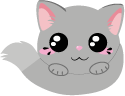

# CAT CURLING

A fun little game with Cats and Curling, build with Phaser.
Made by Alexander Tischhart, Denise Buder & Selina Brunner.

## Install
- Get the files (clone or zip)
- `cd CatCurling-MMP`
- `nvm install`
- `npm install`

## Development
- `npm run develop`
- Open `http://localhost:8080`

## Build
- `npm run build`
- Javascript bundle will be in `/public/assets/bundle.js`

## Github page deployment
- `npm run deploy`
